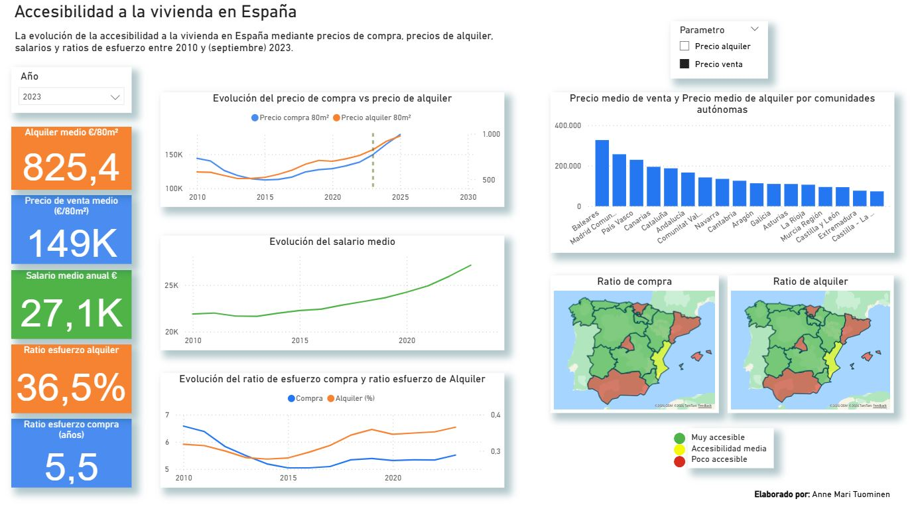

## :house_with_garden: Accesibilidad a la vivienda en España: Un análisis evolutivo (2010-2023)
---


### :page_facing_up: Descripcion general del proyecto

Dashboard interactivo desarrollado en Power BI que analiza la evolución del mercado inmobiliario en España durante el periodo 2010-2023. El proyecto mide la accesibilidad económica cruzando datos de precios de vivienda de Idealista con indicadores de salarios del INE, visualizando brechas regionales y puntos de tensión financiera en la última década.


**Fuentes de datos:**
> Precios de Vivienda: Datos de mercado extraídos de los informes del [Índice de precios inmobiliarios de Idealista](https://www.idealista.com/sala-de-prensa/informes-precio-vivienda/).
> Indicadores Salariales: Datos sobre la ganancia media anual por trabajador obtenidos de la [Encuesta Anual de Estructura Salarial del INE](https://www.ine.es/jaxiT3/Tabla.htm?t=28191&L=0).

_Nota: Los datos fueron extraídos y procesados en formato CSV/Excel para su posterior modelado en Power BI._

**Conjunto de datos:** Este análisis integra series históricas de precios de mercado publicadas por Idealista con los niveles salariales oficiales del INE, permitiendo contrastar el coste real de la vivienda frente a la capacidad adquisitiva de los hogares españoles entre 2010 y 2023.

**Aspectos clave analizados:** 
- Evolución histórica de precios de venta y alquiler. 
- Evolución de los salarios y su impacto en la capacidad adquisitiva. 
- Comparativa territorial de accesibilidad por comunidad autónoma. 
- Ratios de esfuerzo para comprar y alquilar una vivienda estándar.
 --- 

### 🛠️ Herramientas utilizados

**Visualización y Dashboarding**


**Limpieza y normalización de datos de fuentes heterogéneas**


**Cálculo de medidas dinámicas y variaciones interanuales**


**Assistencia de AI**


### :pushpin: Implementación básica de DAX

¿Es más accesible comprar o alquilar vivienda en España? 

Para responder as la pregunta, construí un modelo en Power BI que integra la evolución de salarios, precios de venta y precios de alquiler. Esto me permite calcular los dos indicadores clave de accesibilidad: 
 
⏳ Ratio de esfuerzo de compra (años de salario necesarios para comprar una vivienda de 80m²). 
```DAX
Compra = 
DIVIDE(
    AVERAGE('Precio venta'[Precio de venta]) * 80,
    AVERAGE('Salario'[Salario medio])
)
```

⚖️ Ratio de esfuerzo de alquiler (porcentaje del salario anual que se destina al alquiler)
```DAX
Alquiler (%) = 
DIVIDE(
    AVERAGE('Alquiler'[Precio de alquiler]) * 12 * 80,
    AVERAGE('Salario'[Salario medio])
) * 100
```

## :bar_chart: Dashboard Overview


